<!--
  ~ Licensed to the Apache Software Foundation (ASF) under one or more
  ~ contributor license agreements.  See the NOTICE file distributed with
  ~ this work for additional information regarding copyright ownership.
  ~ The ASF licenses this file to You under the Apache License, Version 2.0
  ~ (the "License"); you may not use this file except in compliance with
  ~ the License.  You may obtain a copy of the License at
  ~
  ~    http://www.apache.org/licenses/LICENSE-2.0
  ~
  ~ Unless required by applicable law or agreed to in writing, software
  ~ distributed under the License is distributed on an "AS IS" BASIS,
  ~ WITHOUT WARRANTIES OR CONDITIONS OF ANY KIND, either express or implied.
  ~ See the License for the specific language governing permissions and
  ~ limitations under the License.
  -->
  
# Uniffle: A new chapter for the shuffle in Cloud Native Era

## Background
Shuffle is the process in distributed computing frameworks used to redistribute data between upstream and downstream tasks. It is a crucial component within computing frameworks and directly impacts their performance and stability. 
However, with the exploration of cloud-native architectures, traditional Shuffle solutions have revealed various issues. 

In a cloud-native architecture, with use of techniques such as the separation of storage and compute, mixed deployment.The computational nodes have relatively low disk volume, poor IO performance, and an imbalance between CPU and IO resources.
Additionally, computational nodes could be preempted by high-priority jobs due to mixed deployments.

In traditional Shuffle implementations, shuffle nodes tightly coupled with computational nodes. However, due to the different resource requirements for disk, memory and CPU between computational nodes and shuffle nodes, it is challenging to independently scale them based on their resource needs.
By separating the computational nodes from shuffle nodes, the computational node's state becomes more lightweight after offloading the Shuffle state to shuffle nodes, reducing the job recomputation when computational nodes are preempted. 

Decoupling computational and Shuffle nodes also reduces the demand for disk specifications on computational nodes, enabling an increase in the number of accessible computational nodes.

In cloud-native architectures, large Shuffle jobs can exert significant pressure on local disk drives, leading to issues such as insufficient disk capacity on computational nodes and higher disk random IO, thus affecting the performance and stability of large Shuffle jobs.

The industry has explored various new Shuffle technologies, including Google's BigQuery, Baidu DCE Shuffle, Facebook's Cosco Shuffle, Uber Zeus Shuffle, Alibaba's Celeborn Shuffle, and many others.
Each system has made its own trade-offs based on different scenarios. Uniffle aims to create a fast, accurate, stable and cost-efficient cloud-native Remote Shuffle Service, considering performance, correctness, stability, and cost as its core aspects.

## Architecture
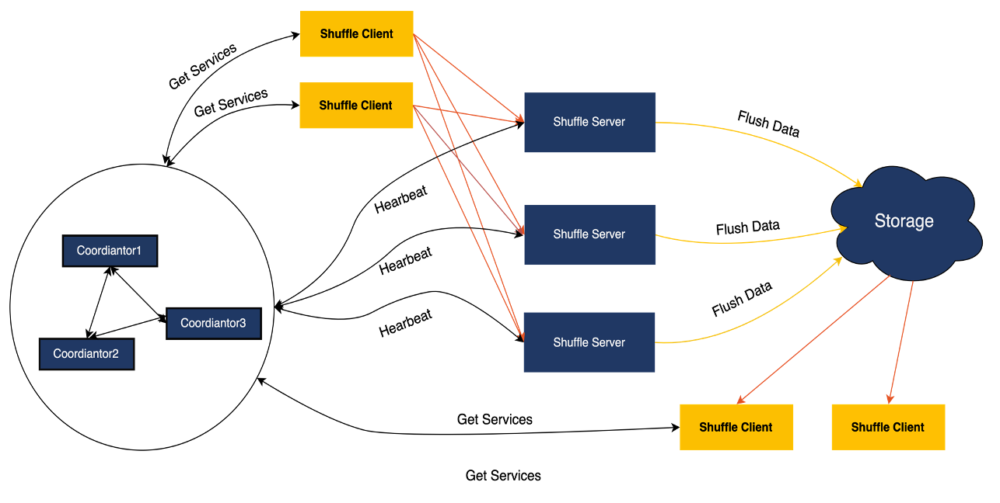
### Coordinator
The Coordinator is responsible for managing the entire cluster, and the Shuffle Server reports the cluster's load situation to the Coordinator through heartbeats. Based on the cluster's load, the Coordinator assigns suitable Shuffle Servers for jobs. To facilitate operations and maintenance, the Coordinator supports configuration deployment and provides a RESTFUL API for external access.

### Shuffle Server
Shuffle Server is primarily responsible for receiving , aggregating  and writing shuffle data into storage. For Shuffle data stored in local disks, Shuffle Server provides the ability to read the data.

### Client
The Client is responsible for communicating with the Coordinator and Shuffle Server. It handles tasks such as requesting Shuffle Servers, sending heartbeats, and performing read and write operations on Shuffle data. It provides an SDK for Spark, MapReduce and Tez to use.

## Read & Write process
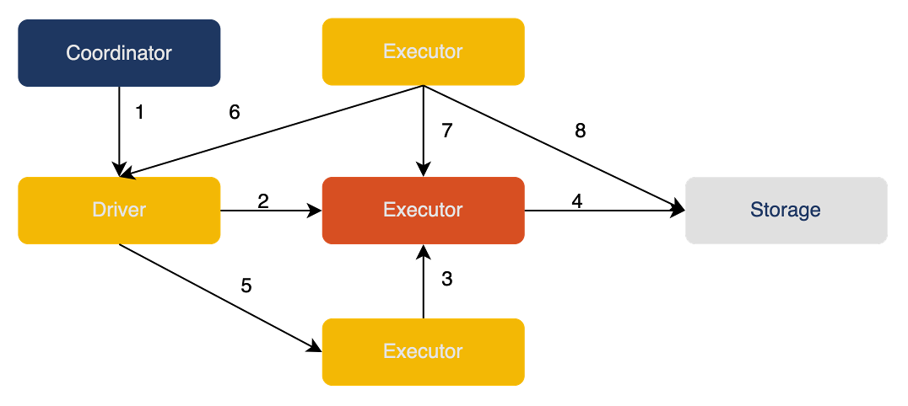
1. The Driver obtains allocation information from the Coordinator.
2. The Driver registers Shuffle information with the Shuffle Server.
3. Based on the allocation information, the Executor sends Shuffle data to the Shuffle Server in the form of Blocks.
4. The Shuffle Server writes the data into storage.
5. After write task is completed, the Executor updates the result to the Driver.
6. The read task retrieves successful write task information from the Driver.
7. The read task retrieves Shuffle metadata (such as all blockIds) from the Shuffle Server.
8. Based on the storage model, the read task reads Shuffle data from the storage side.

## Performance

### 1) Hybrid storage
In our internal production environment, there are Partition data blocks at the KB level which account for more than 80% of the total. In order to effectively address the random IO issues caused by these small partitions, Uniffle incorporates the concept of in-memory Shuffle, taking reference from Google's Dremel. Additionally, considering that 80% of the data capacity in the our production environment is due to large partitions, Uniffle introduces disk and HDFS as storage media to address the data capacity problem. This forms a hybrid storage solution.

### 2) Random IO Optimization
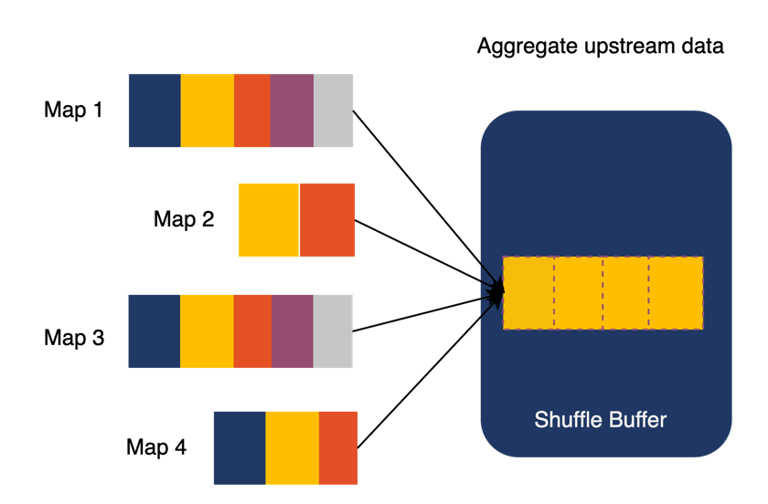
The essence of random IO is the existence of numerous small data block operations. In order to avoid these operations, Uniffle first aggregates multiple MapTasks' identical partitions in the memory of the Shuffle Server to generate larger partition data. When the Shuffle data in memory reaches the partition threshold or the overall threshold, it is written into local or remote storage.
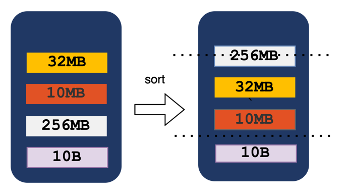
When the overall threshold of memory reached, Uniffle sorted the partition data in memory based on their size. Uniffle write the larger partitions to the storage media first. Additionally, when the data in memory reach to a certain size, the writing of Shuffle data to the storage media is stopped, let some data stay in the memory to further reduce random IO on the disk.

### 3) Storage media selection strategy
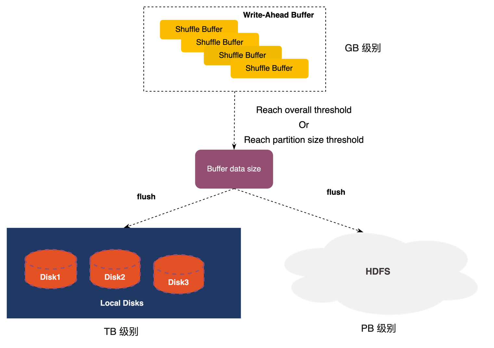
For writing Shuffle data to local or remote storage, Uniffle has observed through testing that larger data block sizes result in better write performance for remote storage. When the data block size exceeds 64MB, the write performance to remote storage can reach 32MB/s. It's enough writing speed if we use multiple threads to write, comparing to the 100MB/s writing speed of HDD.Therefore, when writing data to storage media, Uniffle selects to write larger data blocks to remote storage based on their size, while smaller data blocks are written to local storage.

### 4) Write concurrency
For larger partitions, it is challenging to meet the performance requirements of writing to remote storage with a single thread. In HDFS, a file can only be written by one writer. To address this limitation, Uniffle allows multiple files to be mapped to a single partition for remote storage. Uniffle utilizes multi-threading to increase the writing performance of large partitions. However, it's important to note that a single partition occupying all remote storage threads can affect the writing performance of other partitions. Typically, there is a maximum limit on the number of concurrent write threads for a single partition. To avoid creating too many files, during the writing process, a partition will prioritize using already existing files. Only when all existing files are being written to, a new file will be created to store the data.

### 5) Data Distribution
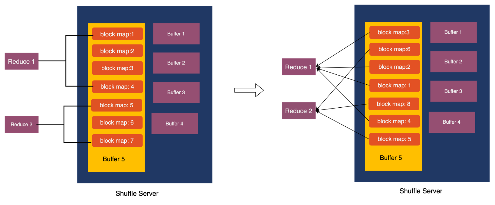
For computational engines like Spark AQE (Adaptive Query Execution), there are scenarios where a single task needs to read only a portion of a partition's data, as well as scenarios where multiple partitions need to be read. In the case of reading a portion of a partition's data, if the data is randomly distributed, it can result in a significant amount of read amplification. Performing data sorting and rewriting after the data is written can lead to considerable performance loss. Therefore, Uniffle adopts a solution of partial ordering to optimize the reading of partial data. For more detailed information, please refer to [3].
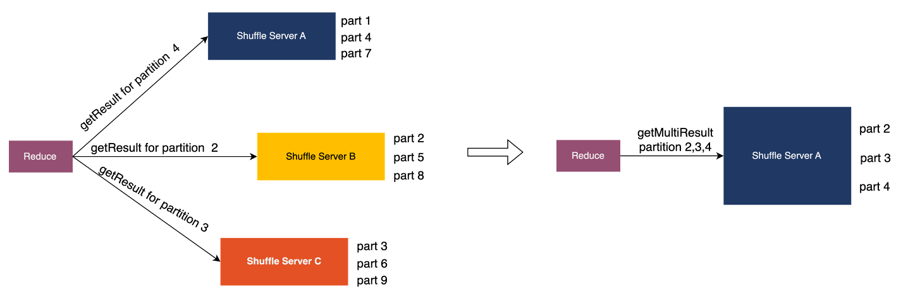
In scenarios where multiple partitions need to be read, an optimization technique in Uniffle involves allocating the task of reading multiple partitions to a single ShuffleServer. This allows for the aggregation of Rpc (Remote Procedure Call) requests, which means that multiple Rpc requests can be sent to a single Shuffle Server. This approach helps to minimize network overhead and improve overall performance. For more detailed information, please refer to [4].

### 6) Off-heap memory management
In the data communication process of Uniffle, Grpc is used, and there are multiple memory copying processes in the Grpc code implementation. Additionally, the Shuffle Server currently uses heap memory for management. When using an 80GB memory Shuffle Server in a production environment, it may experience a significant amount of garbage collection (GC), with individual GC pauses lasting approximately 22 seconds. To address this issue, Uniffle upgraded the JDK to version 11. On the data transmission side, Uniffle refer to the communication protocol of Spark Shuffle and adopted Netty for data transfer. It also utilized ByteBuf to manage off-heap memory more efficiently.

### 7) Columnar Shuffle Format
The Uniffle framework itself does not natively support columnar Shuffle. To leverage the columnar Shuffle capabilities, Uniffle integrates with Gluten, a columnar shuffle component. By integrating with Gluten, Uniffle is able to reuse the columnar Shuffle capabilities provided by Gluten. For more detailed information, please refer to [5].
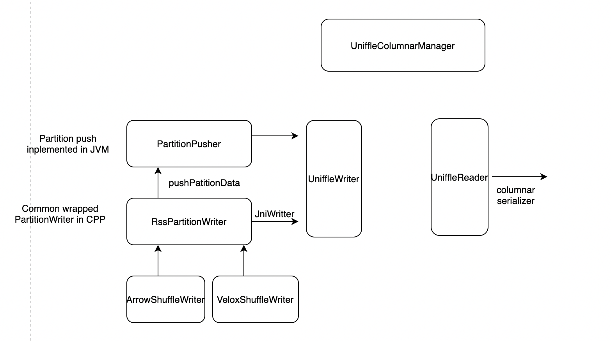

### 8) Barrier-Free
For batch processing in distributed computing frameworks, the commonly used model is the Bulk Synchronous Parallel (BSP) model. In this model, downstream tasks started after all upstream tasks have completed. However, to reduce the impact of straggler nodes on job performance, some computing frameworks support a "slow start" mechanism to allow upstream and downstream tasks to run concurrently. On the other hand, for stream processing and OLAP engines, a pipeline model is used where upstream and downstream tasks can run simultaneously.

To cater to various computing frameworks, Uniffle employs a barrier-free design that allows upstream and downstream stages to run concurrently. The key to achieving this barrier-free execution lies in supporting efficient in-memory read/write operations and an effective index filtering mechanism. With this design, job execution does not require a request to the Shuffle Server for writing all data to storage media at the end of each stage. Additionally, since upstream and downstream stages run simultaneously, there may be cases where downstream readers only need to read incremental data. The index filtering mechanism effectively avoids reading redundant data.

Uniffle has designed both bitmap index filtering and file index filtering mechanisms to handle in-memory and storage media data respectively. This enables Uniffle to efficiently support barrier-free execution and improve performance by avoiding redundant data reads.

### Performance evaluation
When using version 0.2 of Uniffle and conducting benchmarks, Uniffle's shuffle performance is similar to Spark's vanilla shuffle for small data volumes. However, for large data volumes, Uniffle's shuffle outperforms Spark's vanilla shuffle by up to 30%. The benchmark results can be found at the following link: https://github.com/apache/incubator-uniffle/blob/master/docs/benchmark.md

##  Correctness

### Metadata Verification
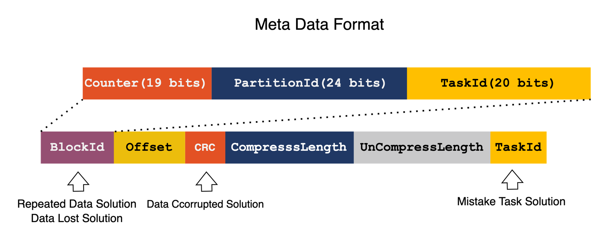
Spark reports information about all completed tasks to the driver. In the first step of the reducer, the reducer retrieves a list of task unique identifiers from the driver. Blocks are the data sent from mappers to the shuffle server, and each block has a unique identifier. The data of a block is stored in memory, on local disk, or in HDFS. To ensure data integrity, Uniffle incorporates metadata verification. Uniffle designs index files for data files stored on local disks and in HDFS. The index file contains information such as the block ID, relative offset, data checksum, compressed length, uncompressed length, and task ID. Before reading a data file, Uniffle first reads the corresponding index file. To address duplicate read issues, Uniffle uses a bitmap to keep track of the already read block IDs. By checking the block ID, Uniffle can determine if a duplicate read exists.

### Data Verification
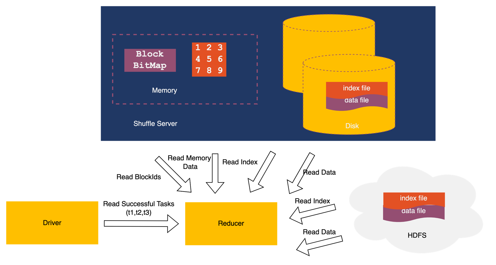
To address data corruption issues, Uniffle performs CRC (Cyclic Redundancy Check) verification on data blocks. When reading data, Uniffle recalculates the CRC and compares it with the CRC stored in the file to determine if the data is corrupted. This helps prevent reading incorrect data.

## Stability
### 1) Fallback for Hybrid storage
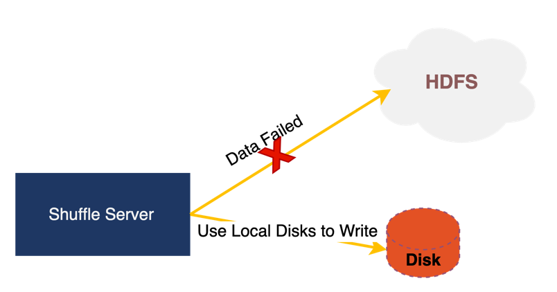
HDFS online clusters may experience some fluctuations in stability, which can result in failures to write data to HDFS during certain time periods. In order to minimize the impact caused by HDFS fluctuations, Uniff has designed a Fallback mechanism. When writing to HDFS fails, the data will be stored locally instead, reducing the impact on the job.

### 2) Flow Control
Before sending a request, the job client will first request the memory resources corresponding to the data. If there is insufficient memory, the job will wait and stop sending data, thereby implementing flow control for the job.

### 3) Replication
Uniffle adopts the Quorum replica protocol, allowing jobs to configure the number of replicas for their data writes based on their own needs. This helps prevent stability issues caused by having only a single replica for the job.

### 4) Stage Recomputation
Currently, Spark supports recomputing the entire stage if there is a failure in reading from the Shuffle Server, helping the job recover and resume its execution.

### 5) Quota Management
When a job reaches the user's quota limit, the Coordinator can make the job fallback to the vanilla Spark mode. This prevents from the situation that a single user's erroneous submission of numerous jobs.

### 6) Coordinator HA
Uniffle does not choose solutions like Zookeeper, Etcd, or Raft for high availability (HA) purposes, mainly considering the complexity introduced by these consensus protocol systems. For Uniffle, the Coordinator is stateless and does not persist any state. All state information is reported by the Shuffle Server through heartbeats, so there is no need to determine which node is the master. Deploying multiple Coordinator instances ensures high availability of the service.

## Cost Effective
### 1) Low-Cost Remote Storage
In general, for a relatively stable business, computational resources tend to remain stable while storage resources grow linearly. These storage resources store a large amount of cold data. Uniffle supports hybrid storage, which allows the utilization of these unused storage resources, thereby reducing the overall system cost.

### 2) Automatic Scaling
Uniffle has developed a K8S Operator that implements scaling operations for stateful services using webhooks. By leveraging Horizontal Pod Autoscaler (HPA), automatic scaling can be achieved, further reducing system costs.

## Community Engagement
Currently, Uniffle supports multiple computational frameworks such as Spark, MapReduce, and Tez.

Uniffle Spark has been adopted by companies like Tencent, Didi, iQiyi, SF Express, and Vipshop, handling PB-level data on a daily basis.

Uniffle MapReduce is employed in mixed deployment scenarios by companies like Bilibili and Zhihu
 
Uniffle Tez has been jointly developed by HuoLaLa, Beike, and Shein.

The development of many important features in the community has involved contributions from well-known Chinese internet companies.
For example, iQiyi has contributed support for accessing Kerberos HDFS clusters and has optimized the performance of Spark AQE on Uniffle.Didi has added support for multi-tenant job quotas. Netty data plane optimizations were jointly completed by Didi and Vipshop.The support for Gluten was contributed by Baidu and SF Express.

Currently, the community has more than 50 contributors, with over 600 commits, and has released four Apache versions. It is being used by dozens of companies. Additionally, teams and companies interested in contributing to Uniffle Flink can contact the Uniffle community at mailto:dev@uniffle.apache.org.

Currently, there are no companies participating in the community with deployment scenarios or development plans for Uniffle Flink. Your help in filling this gap in the community would be greatly appreciated. Uniffle's design incorporates a large number of mechanisms and strategies, and users are welcome to contribute strategies that suit their own scenarios.

## Future Plans
### Storage Optimization
1. Integration with object storage to optimize system costs.
2. Merging index files and data files to further reduce IO overhead.
3. Support for heterogeneous storage resources such as SSD and HDD.
4. Support for sorting data by key.

### Computation Optimization
1. Support for dynamic allocation of Shuffle Servers.
2. Partial support for Slow Start feature in some engines.
3. Continuous optimizations for Spark AQE.
4. Support for the Flink engine.
5. Asynchronous data reading support for compute engines.

## Summary
Uniffle has been designed with a focus on performance, correctness, stability, and cost-effectiveness, making it a suitable Shuffle system for cloud-native architectures. We welcome everyone to contribute to the Uniffle project. The Uniffle project can be found at https://github.com/apache/incubator-uniffle.

## Reference
[1] https://cloud.tencent.com/developer/article/1903023

[2] https://cloud.tencent.com/developer/article/1943179

[3] https://github.com/apache/incubator-uniffle/pull/137

[4] https://github.com/apache/incubator-uniffle/pull/307

[5] https://github.com/apache/incubator-uniffle/pull/950
