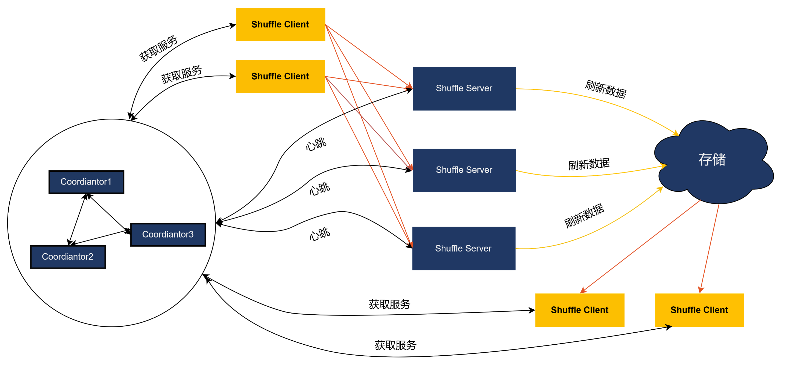
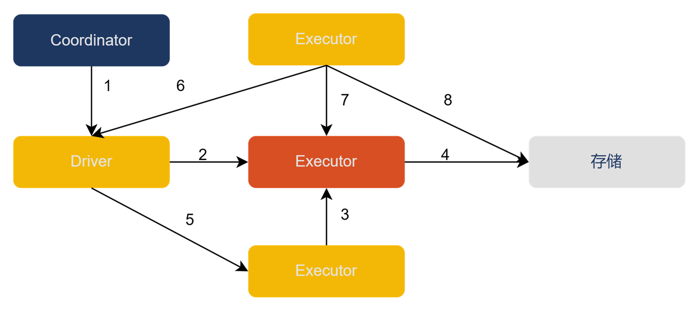
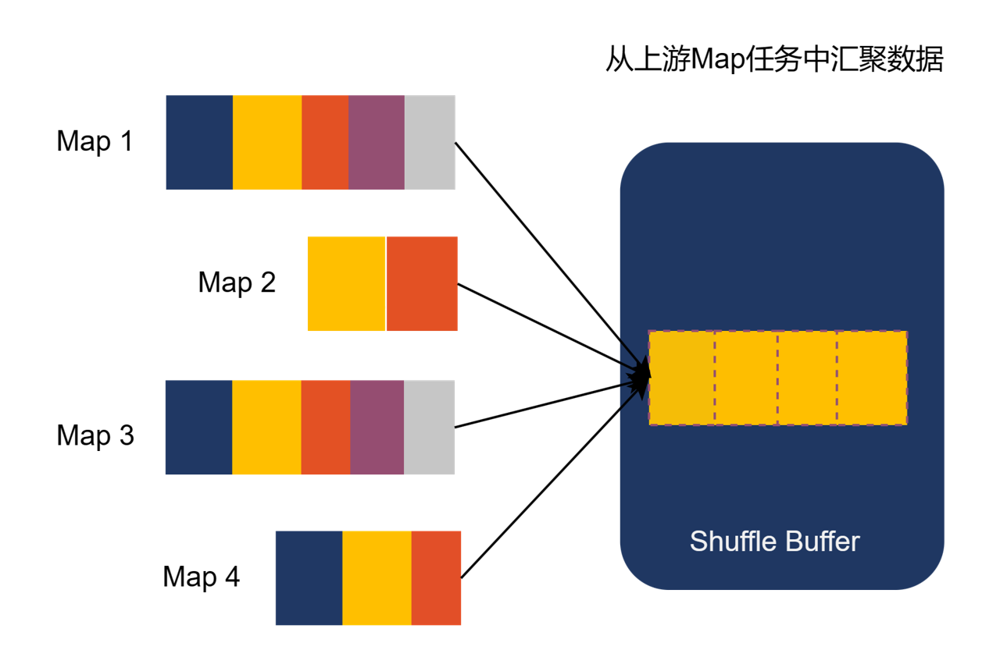
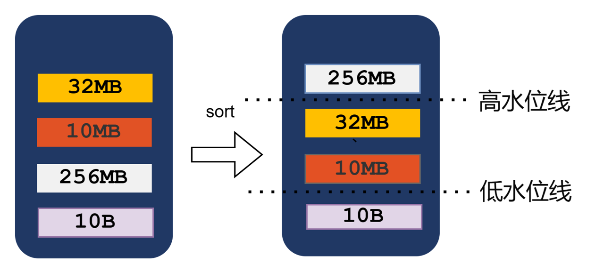
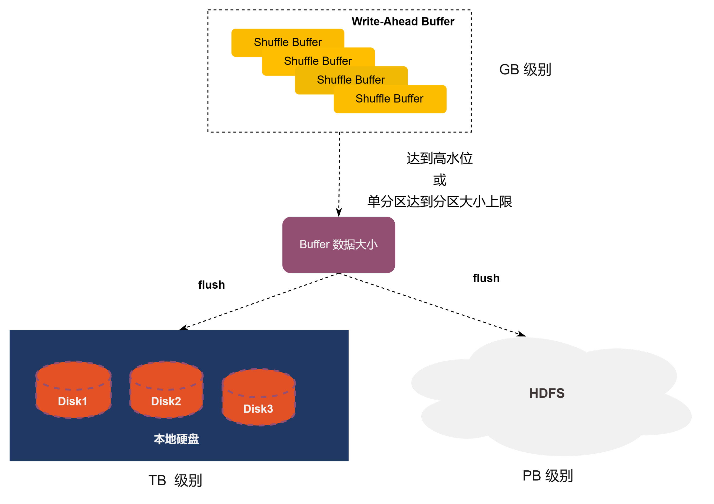
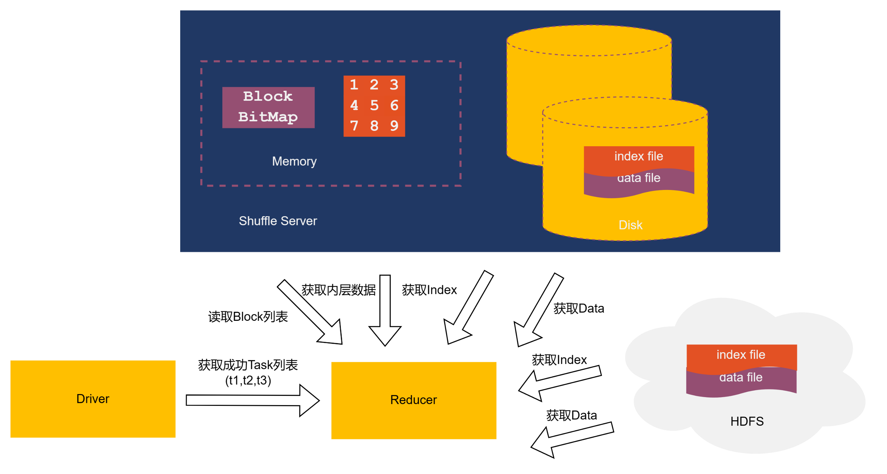
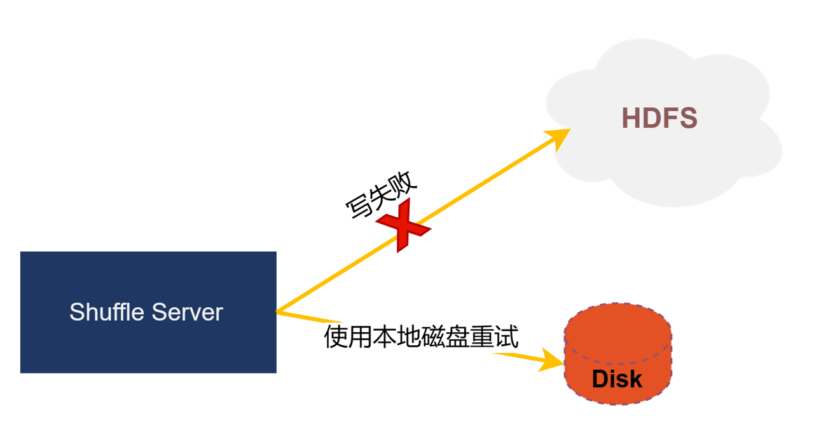

<!--
  ~ Licensed to the Apache Software Foundation (ASF) under one or more
  ~ contributor license agreements.  See the NOTICE file distributed with
  ~ this work for additional information regarding copyright ownership.
  ~ The ASF licenses this file to You under the Apache License, Version 2.0
  ~ (the "License"); you may not use this file except in compliance with
  ~ the License.  You may obtain a copy of the License at
  ~
  ~    http://www.apache.org/licenses/LICENSE-2.0
  ~
  ~ Unless required by applicable law or agreed to in writing, software
  ~ distributed under the License is distributed on an "AS IS" BASIS,
  ~ WITHOUT WARRANTIES OR CONDITIONS OF ANY KIND, either express or implied.
  ~ See the License for the specific language governing permissions and
  ~ limitations under the License.
  -->
  
##  项目背景
Shuffle 是分布式计算框架用来衔接上下游任务数据重分布的过程，是计算框架中最为重要的一个环节，Shuffle 的性能和稳定性会对计算框架产生直接的影响。然而随着对云原生架构探索，传统的 Shuffle 方案也暴露了诸多问题。

在云原生架构中，也会同时应用存算分离以及混部等技术。计算节点磁盘相对容量较小，IO 性能较差，CPU 和 IO 资源相对不平衡。计算节点也可能因为混部的原因，被高优先级的作业所抢占。

传统的 Shuffl 方案，Shuffle 节点与计算节点耦合在一起，但是由于计算节点与 Shuffle 节点对于磁盘资源，内存资源，CPU资源，节点稳定性的需求不同，难以对他们根据资源需求进行独立扩容。
将计算节点和 Shuffle 节点分离后，计算节点将Shuffle状态托管到Shuffle节点后，也同样让计算节点的状态更轻量化，在计算节点被抢占时可以减少作业的重算。

由于计算节点和 Shuffle 节点解耦，同时也降低了计算节点对磁盘规格的需求，可以增加可接入的计算节点数量。

对于大的 Shuffle 作业在云原生架构下会对本地磁盘磁盘造成比较大的压力，会造成计算节点磁盘容量不足等问题，同时也会产生比较多磁盘随机 IO，影响大 Shuffle 作业的性能和稳定性。

业界对新的 Shuffle 技术探索有包括 Google 的 BigQuery，百度 DCE Shuffle，Facebook 的 Cosco Shuffle，Uber Zeus Shuffle，阿里 Celeborn Shuffle 等诸多实践。
各个系统有着自身对于各自场景不同的取舍。Uniffle 从性能，正确性，稳定性，成本四个方面的入手，想要打造快准稳省的云原生 Remote Shuffle Service。

## 架构设计

### Coordinator
Coordinator 负责管理整个集群，Shuffle Server 通过心跳的方式将集群的负载情况汇报给 Coordinator。Coordinator 根据整个集群负责情况为作业分配合适 Shuffle Server。为了便于运维，Coordinator支持配置下发的功能，对外提供 RESTFUL API。

### Shuffle Server
主要负责接收 Shuffle 数据，聚合后写入存储当中。对于存储在本地磁盘当中的 shuffle 数据，Shuffle Server为其提供数据读取的能力。

### Client
负责和 Coordinator 和 Shuffle Server 通信，负责申请 Shuffle Server，发送心跳以及 Shuffle 数据的读写。提供 SDK 给 Spark，MapReduce，Tez 使用。

## 读写流程

1. Driver 从 Coordinator 获取分配信息
2. Driver 向 Shuffle Server 注册 Shuffle 信息 
3. 基于分配信息，Executor 将 Shuffle 数据以 Block 的形式发送到 Shuffle Server
4. Shuffle Server 将数据写入存储
5. 写任务结束后，Executor 向 Driver 更新结果
6. 读任务从 Driver 侧获取成功的写 Task 信息
7. 读任务从 Shuffle Server 获得 Shuffle 元数据(如所有的 blockId)
8. 基于存储模式，读任务从存储侧读取 Shuffle 数据

## 性能方面

### 1) 混合存储
在现网存在数目超过 80% 的 KB 级别的 Partition 数据块，为了可以很好的解决这些小 Partiton 带来的随机 IO，Uniffle 参考 Google 的 Dremel 引入内存 Shuffle 的概念，同时考虑到现网数据总容量 80% 是大的 Partition 带来的，从而选择引入磁盘和 HDFS 作为 Uniffle 的存储介质，解决数据容量的问题，从而形成一套混合存储的方案。

### 2) 随机IO优化
  
随机 IO 本质是由于比较多小数据块的 IO 存在，为了避免比较多小数据块 IO 的存在，Uniffle 首先会将多个 MapTask 的相同 Partition 在 Shuffle Server 中的内存进行聚合产生较大的 Partition 数据，当内存中 Shuffle 数据达到 Partition 阈值或者是整体阈值时，内存中 Shuffle 数据开始写入本地存储或者远程存储。
  
当达到内存的整体阈值时，会按照内存中 Partition 数据大小进行排序，然后将大的 Partition 优先写入存储介质当中同时，内存中的数据下降到一定程度后会停止继续向存储介质写入 Shuffle 数据，进一步减少磁盘的随机 IO。

### 3) 存储介质选择优化

对于 Shuffle 数据写入本地存储还是远程存储，Uniffle 根据测试发现数据块大小越大，远程存储的写入性能越好。当数据块超过 64MB 的时候，写入远程存储的性能可达 32MB/s。所以，在数据写入存储介质时，会选择根据数据块大小，将大的数据块写入远程存储。把小的数据块写入本地存储。

### 4) 写入并发度优化
对于大的 Partition 来说，单线程写入远程存储性能难以满足需求。HDFS 的文件只能由一个 Writer 写入，对于远端存储，Uniffle 将一个 Partition 可以映射多个文件。Uniffle 使用多线程方式可以增加大 partition 的写入性能。同时，单 Partition 占用全部远程存储线程数目影响其他Partition 数据的写入，单 Partition 通常会有一个同时写入线程数目上限。为避免产生过多的文件，Partition 在写入过程时会优先使用已经创建的文件，只有当所有的文件都在写入数据中，会新建一个文件写入数据。

### 5) 数据分布优化
  
对于计算引擎来说，例如 Spark AQE ，存在单个 Task 读取某一个 Partition 部分数据以及多个 Partition 的情况。对于读取 Partition 部分数据情况，如果数据是随机分布的，会造成大量的读放大。如果在数据写入后进行数据排序重写，会造成较大的性能损耗。所以 Uniffle 采用局部有序的方案优化读取部分数据的数据优化。详细信息可查看参考 [3]。
  
同样读取多个 Partition 时候，如果可以将需要读取多个 Partition 分配到一个 ShuffleServer 上，可以聚合 Rpc 请求，将多个 Rpc 请求发送到一个 Shuffle Server 当中。详细信息可查看参考 [4]。

### 6) 堆外内存优化
Uniffle 的数据通信过程中使用了 Grpc，Grpc 代码实现中存在比较多的内存拷贝过程。同时，Shuffle Server 目前使用堆内存进行管理。在线上使用 80G 内存的 Shuffle Server 会产生较多的 GC，单次最长约 22s。为此 Uniffle 将 JDK 升级到 11 以解决此问题。同时在数据传输面，模仿Spark Shuffle 的通信协议使用 Netty 进行数据传输，并且使用 ByteBuf 来对堆外内存进行管理。

### 7) 列式格式优化 
Uniffle 框架本身不支持列式 Shuffle，采用集成 Gluten 的方案来复 用Gluten 列式 Shuffle 能力。详细可看参考 [5]。

### 8) 去 Barrier 化
分布式计算框架对于批量计算来说一般采用的 BSP （Bulk Synchronous Parallel）模型，上游 Task 全部运行完才会启动下游的 Task，但是为了可以减少长尾节点对作业对作业运行性能的影响，有得计算框架会支持 Slow Start 让上下游作业可以同时运行。流式计算，OLAP 引擎会采用上下游可以同时运行 Task 的 Pipeline 模型。

为了可以适配更多的计算框架，Uniffle 采用了去 Barrier 的设计，可以支持上下游 Stage 同时运行。去 Barrier 化的关键在于需要可以支持内存读写和高效的索引过滤机制，这样作业在运行的过程无需在 Stage 结束时向 Shuffle Server 发送将数据全部写到存储介质当中的请求，而且由于上下游同时运行，会存在下游Reader对数据读取增量数据的情况，拥有了索引过滤机制，可以有效的避免冗余数据的读取。

Uniffle 分别针对内存数据和存储介质数据设计了 Bitmap 索引过滤和文件索引过滤。这使得 Uniffle 能够有效支持无障碍执行，并通过避免冗余数据读取来提高性能。

### 性能测试
使用 0.2 版本时，Uniffle 通过进行 Benchmark 发现，小数据量的 Shuffle 可以和 Spark 原生 Shuffle 持平。大数据量的 Shuffle 可以比 Spark 原生 Shuffle 快 30%。Benchmark结果链接: https://github.com/apache/incubator-uniffle/blob/master/docs/benchmark.md

## 正确性

### 元数据校验

Spark 会将所有完成状态的 task 信息汇报给 Drvier，Reducer 第一步是先从 Driver 中获取 Task 唯一标识符列表， Block 是 Mapper 发送给 Shuffle Server 的数据，每一个 Block 都有唯一确定的 ID，Block 的数据会分别存储在内存，本地磁盘以及HDFS上。为了保证数据的安全性，Uniffle 设计了相应的元数据，Uniffle 对于本地磁盘和 HDFS 中的数据文件设计了索引文件。索引文件的格式由 BlockID，相对位移量，数据校验，压缩长度，未压缩长度以及 taskID，在读取 DataFile 之前 Uniffle 会先读取索引文件对于重复读取问题，Uniffle 会使用一个 bitmap 来保存已经读取的 BlockID，通过 BlockID 来判断是否存在重复读取。

### 数据校验

对于数据损坏问题，Uniffle 会对数据块进行 CRC 校验，读取时会对数据重新进行计算 CRC，对比文件中的 CRC 文件判断数据是否损坏对于误读问题。

## 稳定性 
### 1) 混合存储Fallback

HDFS 线上集群存在一定的波动性，可能存在某个时间段会存在写 HDFS 数据失败的情况，为了减少 HDFS 波动产生的影响，Uniff 设计了 Fallback 机制，当写 HDFS 失败后，会将数据写入到本地存储，减少对作业的影响。

### 2) 限流机制
作业 Client 发送请求之前会先申请数据所对应的内存资源，如果内存不足，作业会进行等待，不再进行数据发送，从而实现了作业的流控。

### 3) 多副本机制
Uniffle 采用 Quorum 副本协议，作业可以根据自身需求配置自身作业写入的副本数目。防止由于单副本造成的作业稳定性问题。

### 4) Stage 重算
目前 Spark 支持如果读取 Shuffle Server 失败，可以将整个 Stage 进行重算来帮助作业恢复作业运行。

### 5) Quota 机制
当集群容量到达上限或者作业达到用户的 Quota 上限之后 Coordinator 可以让作业 Fallback 成原生 Spark 的模式。防止集群压力过大或者单用户错误提交大量作业影响集群的稳定性。

### 6) Coordinator HA 机制 
没有选择 Zookeeper，Etcd 以及 Raft 等方案作为 HA 方案，主要是考虑的是引入这些一致性协议系统的复杂性。对于 Uniffle 来说，Uniffle 选择将 Coordinator 无状态化，不持久化任何状态，所有的状态信息由 Shuffle Server 心跳汇报而来，所以无须确定哪个是主节点，只要部署多个 Coordinator 实例即可保证服务的高可用。

## 成本
### 1) 使用低成本远程存储
一般来说对于一个相对稳定的业务，计算资源相对稳定，存储资源将会线性增长。这些存储资源将会存储大量的冷数据。Uniffle 支持混合存储，可以将这部分没有利用的存储资源进行利用，从而降低系统整体的成本。

### 2) 使用自动扩缩容
同时 Uniffle 研发了一个 K8S Operator，利用 Webhook 的方式实现了有状态服务的扩缩容操作，利用 HPA 可以在此基础上实现自动扩缩容，进一步降低系统成本。

## 社区运营
目前 Uniffle 已经支持 Spark，MapReduce，Tez 等多种计算框架。

Uniffle Spark 已经在腾讯，滴滴，爱奇艺，顺丰，唯品会等多家都有日均PB级数据的实践。

Uniffle MapReduce 被B站，知乎等公司混部场景下所使用。

货拉拉，贝壳，Shein 共同开发完成了 Uniffle Tez 开发，预计在 23 Q3 正式开始使用。

社区诸多重要 Feature 都有国内诸多知名互联网公司的参与开发。
爱奇艺支持了对 Keberos HDFS 集群的访问，并且优化了 Spark AQE on Uniffle 的性能。滴滴支持了多租户作业 Quota。Netty 优化数据面由滴滴和唯品会共同完成。Gluten 的支持由百度和顺丰共同完成。

目前社区已经有 50+ contributor，600+ commits，发布了 4 个 Apache 版本，被数十家公司所使用。另外，想要贡献 Uniffle Flink 的团队和公司，可以发送邮件到 dev@uniffle.apache.org 与 Uniffle 社区联系。

目前社区参与的公司中还没有对 Uniffle Flink 有落地场景以及相应的开发计划，期待您可以帮忙一起填补社区的这块空白。Uniffle 设计采用了大量的机制和策略分离，也欢迎各个用户可以贡献适合自身场景的策略。

## 后续规划
### 存储优化
1. 对接对象存储，优化系统成本
2. 索引文件和数据文件合并进一步减少IO开销
3. SSD和HDD异构存储资源的支持
4. 支持存储数据可以按Key进行排序

### 计算优化
1. 支持完善Shuffle Server动态分配机制
2. 部分引擎Slow Start特性的支持
3. Spark AQE支持的持续优化
4. Flink引擎支持
5. 计算引擎数据支持异步读取

## 总结
Uniffle 从性能，正确性，稳定性，成本四个方面思考，打造了一款适合云原生架构的 Shuffle 系统。欢迎大家参与贡献 Uniffle 项目，Uniffle 项目地址是 https://github.com/apache/incubator-uniffle 。

## 参考资料 
[1] https://cloud.tencent.com/developer/article/1903023

[2] https://cloud.tencent.com/developer/article/1943179

[3] https://github.com/apache/incubator-uniffle/pull/137

[4] https://github.com/apache/incubator-uniffle/pull/307

[5] https://github.com/apache/incubator-uniffle/pull/950
