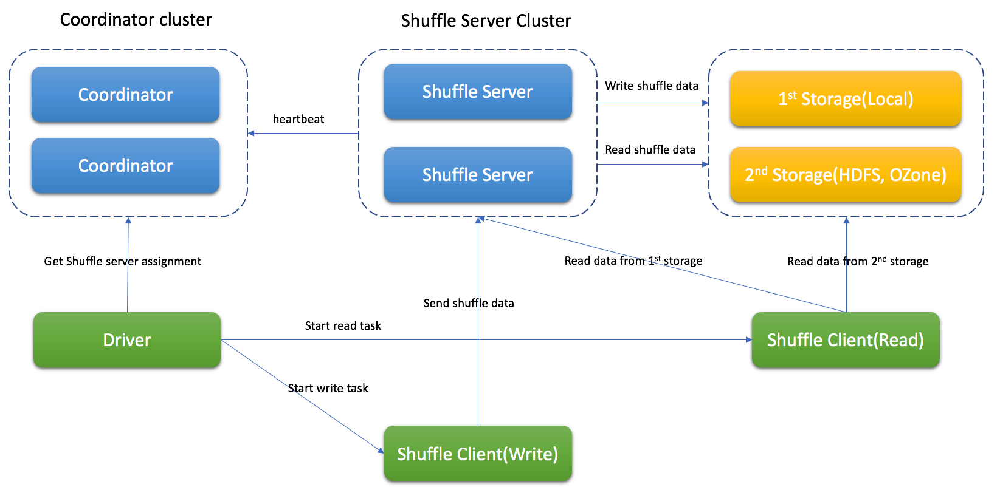
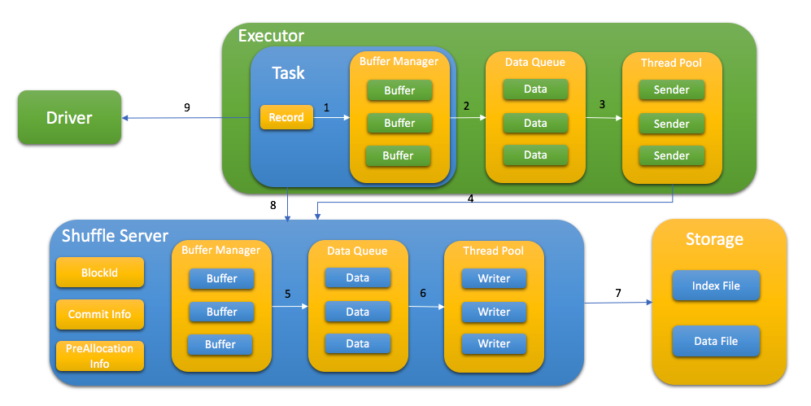
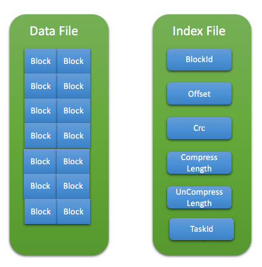

# Uniffle 是什么

Uniffle 是一个远程 Shuffle 服务，它为 Apache Spark 应用程序提供了在远程服务器上存储 Shuffle 数据的功能。

[](https://github.com/apache/incubator-uniffle/actions/workflows/build.yml)
[](https://codecov.io/gh/apache/incubator-uniffle)

## 架构

Uniffle 包含 coordinator cluster (协调器集群)、shuffle server(shuffle服务集群) ，另外如有需要，还可以提供远程存储的能力（如 HDFS）。

Coordinator 会收集 shuffle 服务的状态并分配任务。

Shuffle服务会接收与合并 shuffle 数据，并它们写入存储内。

根据不同情况，Uniffle 支持：内存&本地存储、内存&远程存储（如 HDFS）、内存&本地存储&及远程存储（推荐用于生产环境）。

## Uniffle 的 Shuffle 处理

* Spark driver 会请求 coordinator 为 shuffle 处理获取 shuffle 服务器
* Spark 任务通过以下步骤将 shuffle 数据写入到 shuffle 服务中：

   1. 将 KV 数据发送到缓冲区
   2. 当缓冲区满或缓冲区管理器满时，将缓冲区刷新到队列中
   3. 线程池从队列中获取数据
   4. 先向shuffle服务申请内存，然后发送shuffle数据
   5. shuffle服务先在内存中缓存数据，并在缓冲区管理器满时刷新到队列中
   6. 线程池从队列中获取数据
   7. 通过索引文件和数据文件将数据写入存储内
   8. 写入数据后，任务向shuffle服务报告所有的 blockId，这一步用于稍后的数据验证
   9. 在 MapStatus 中存储 taskAttemptId，以支持 Spark speculation

* 根据不同的存储类型，spark 任务会从 shuffle 服务、远程存储或同时从两者中读取 shuffle 数据。

## Shuffle 文件格式
shuffle 数据存储在索引文件和数据文件中。数据文件包含特定分区的所有数据块，索引文件则包含每个数据块的元数据。



## 支持的 Spark 版本
当前支持 Spark 2.3.x, Spark 2.4.x, Spark3.0.x, Spark 3.1.x, Spark 3.2.x, Spark 3.3.x

注：如果要支持动态分配，应将补丁（包含在 client-spark/patch 文件夹中）打入 Spark 。

## 支持的 MapReduce 版本
目前支持 Hadoop 2.8.5 的 MapReduce 架构.

## 构建 Uniffle
> 注：目前 Uniffle 需要 JDK 1.8 才能构建，我们的路线图中未来还包括添加对更高版本 JDK 的支持。

Uniffle 使用 [Apache Maven](https://maven.apache.org/) 进行构建。
请执行如下命令进行构建:

    mvn -DskipTests clean package

基于 profile Spark2（2.4.6）进行构建

    mvn -DskipTests clean package -Pspark2

基于 profile Spark3（3.1.2） 进行构建

    mvn -DskipTests clean package -Pspark3

基于  Spark 3.2.x 进行构建

    mvn -DskipTests clean package -Pspark3.2

如果需要打包 Uniffle，请运行：

    ./build_distribution.sh

如果使用 Spark 3.2.x 进行打包，请运行:

    ./build_distribution.sh --spark3-profile 'spark3.2'

最后将生成 rss-xxx.tgz 这样的文件用于部署

## 部署

### 部署 Coordinator

1. 解压打包文件到 RSS_HOME
2. 更新 RSS_HOME/bin/rss-env.sh，例如：
   ```
     JAVA_HOME=<java_home>
     HADOOP_HOME=<hadoop home>
     XMX_SIZE="16g"
   ```
3. 更新 RSS_HOME/conf/coordinator.conf，例如：
   ```
     rss.rpc.server.port 19999
     rss.jetty.http.port 19998
     rss.coordinator.server.heartbeat.timeout 30000
     rss.coordinator.app.expired 60000
     rss.coordinator.shuffle.nodes.max 5
     # enable dynamicClientConf, and coordinator will be responsible for most of client conf
     rss.coordinator.dynamicClientConf.enabled true
     # config the path of client conf
     rss.coordinator.dynamicClientConf.path <RSS_HOME>/conf/dynamic_client.conf
     # config the path of excluded shuffle server
     rss.coordinator.exclude.nodes.file.path <RSS_HOME>/conf/exclude_nodes
   ```
4. 更新 <RSS_HOME>/conf/dynamic_client.conf, rss 客户端将从 coordinator 获取默认配置，例如
   ```
    # MEMORY_LOCALFILE_HDFS is recommandation for production environment
    rss.storage.type MEMORY_LOCALFILE_HDFS
    # multiple remote storages are supported, and client will get assignment from coordinator
    rss.coordinator.remote.storage.path hdfs://cluster1/path,hdfs://cluster2/path
    rss.writer.require.memory.retryMax 1200
    rss.client.retry.max 100
    rss.writer.send.check.timeout 600000
    rss.client.read.buffer.size 14m
   ```
5. 启动 Coordinator
   ```
    bash RSS_HOME/bin/start-coordnator.sh
   ```

### 部署 Shuffle 服务

1. 解压打包文件到 RSS_HOME
2. 更新 RSS_HOME/bin/rss-env.sh，例如：
   ```
     JAVA_HOME=<java_home>
     HADOOP_HOME=<hadoop home>
     XMX_SIZE="80g"
   ```
3. 更新 RSS_HOME/conf/server.conf，例如：
   ```
     rss.rpc.server.port 19999
     rss.jetty.http.port 19998
     rss.rpc.executor.size 2000
     # it should be configed the same as in coordinator
     rss.storage.type MEMORY_LOCALFILE_HDFS
     rss.coordinator.quorum <coordinatorIp1>:19999,<coordinatorIp2>:19999
     # local storage path for shuffle server
     rss.storage.basePath /data1/rssdata,/data2/rssdata....
     # it's better to config thread num according to local disk num
     rss.server.flush.thread.alive 5
     rss.server.flush.threadPool.size 10
     rss.server.buffer.capacity 40g
     rss.server.read.buffer.capacity 20g
     rss.server.heartbeat.timeout 60000
     rss.server.heartbeat.interval 10000
     rss.rpc.message.max.size 1073741824
     rss.server.preAllocation.expired 120000
     rss.server.commit.timeout 600000
     rss.server.app.expired.withoutHeartbeat 120000
     # note: the default value of rss.server.flush.cold.storage.threshold.size is 64m
     # there will be no data written to DFS if set it as 100g even rss.storage.type=MEMORY_LOCALFILE_HDFS
     # please set proper value if DFS is used, eg, 64m, 128m.
     rss.server.flush.cold.storage.threshold.size 100g
   ```
4. 启动 Shuffle 服务
   ```
    bash RSS_HOME/bin/start-shuffle-server.sh
   ```

### 部署 Spark 客户端
1. 将客户端 jar 添加到 Spark classpath，例如 SPARK_HOME/jars/。
   
   Spark2 的 jar 位于 <RSS_HOME>/jars/client/spark2/rss-client-XXXXX-shaded.jar

   Spark3 的 jar 位于 <RSS_HOME>/jars/client/spark3/rss-client-XXXXX-shaded.jar

2. 更新 Spark conf 以启用 Uniffle，例如：

   ```
   spark.shuffle.manager org.apache.spark.shuffle.RssShuffleManager
   spark.rss.coordinator.quorum <coordinatorIp1>:19999,<coordinatorIp2>:19999
   # Note: For Spark2, spark.sql.adaptive.enabled should be false because Spark2 doesn't support AQE.
   ```

### 支持 Spark 动态分配

要使用 Uniffle 支持 spark 动态分配，需要更新 spark 代码。
在 spark-patches 文件夹中有 3 个针对 spark（2.4.6/3.1.2/3.2.1）的补丁供参考。

打完补丁并重新编译 spark 后，在 spark conf 中添加以下配置以启用动态分配：
  ```
  spark.shuffle.service.enabled false
  spark.dynamicAllocation.enabled true
  ```

### 部署 MapReduce 客户端

1. 将客户端 jar 添加到每个 NodeManager 的 classpath，例如 /share/hadoop/mapreduce/

MapReduce 的 jar 位于 /jars/client/mr/rss-client-mr-XXXXX-shaded.jar

2. 更新 MapReduce conf 以启用 Uniffle，例如：

   ```
   -Dmapreduce.rss.coordinator.quorum=<coordinatorIp1>:19999,<coordinatorIp2>:19999
   -Dyarn.app.mapreduce.am.command-opts=org.apache.hadoop.mapreduce.v2.app.RssMRAppMaster
   -Dmapreduce.job.map.output.collector.class=org.apache.hadoop.mapred.RssMapOutputCollector
   -Dmapreduce.job.reduce.shuffle.consumer.plugin.class=org.apache.hadoop.mapreduce.task.reduce.RssShuffle
   ```

请注意，RssMRAppMaster 将自动禁用慢启动（即 `mapreduce.job.reduce.slowstart.completedmaps=1`）和作业恢复（即，`yarn.app.mapreduce.am.job.recovery.enable=false`）。

## 配置

重要配置列举如下。

### Coordinator

| 属性值                                          | 默认值            | 描述                                                             |
| ----------------------------------------------- | ----------------- | ---------------------------------------------------------------- |
| rss.coordinator.server.heartbeat.timeout        | 30000             | 如果无法从 shuffle 服务器取心跳的超时时间                        |
| rss.coordinator.assignment.strategy             | PARTITION_BALANCE | 分配 shuffle 服务的策略，应使用 PARTITION_BALANCE 来平衡工作负载 |
| rss.coordinator.app.expired                     | 60000             | 应用的过期时间（毫秒），心跳间隔应小于它                         |
| rss.coordinator.shuffle.nodes.max               | 9                 | 分配时 shuffle 服务的最大数量                                    |
| rss.coordinator.dynamicClientConf.path          | -                 | 包含 rss 客户端默认配置的 conf 文件路径                          |
| rss.coordinator.exclude.nodes.file.path         | -                 | 排除节点的配置文件路径                                           |
| rss.coordinator.exclude.nodes.check.interval.ms | 60000             | 排除节点的更新间隔（毫秒）                                       |
| rss.rpc.server.port                             | -                 | coordinator 的 RPC 端口                                          |
| rss.jetty.http.port                             | -                 | coordinator 的 Http 端口                                         |

### Shuffle 服务

| 属性值                                             | 默认值 | 描述                                                                               |
| -------------------------------------------------- | ------ | ---------------------------------------------------------------------------------- |
| rss.coordinator.quorum                             | -      | Coordinator 配额                                                                   |
| rss.rpc.server.port                                | -      | Shuffle 服务的 RPC 端口                                                            |
| rss.jetty.http.port                                | -      | Shuffle 服务的 Http 端口                                                           |
| rss.server.buffer.capacity                         | -      | shuffle 服务缓冲区管理器的最大内存                                                 |
| rss.server.memory.shuffle.highWaterMark.percentage | 75.0   | 溢出数据到存储的阈值，为 rss.server.buffer.capacity 的百分比                       |
| rss.server.memory.shuffle.lowWaterMark.percentage  | 25.0   | 内存中保留数据的阈值，为 rss.server.buffer.capacity 的百分比                       |
| rss.server.read.buffer.capacity                    | -      | 读取数据时缓冲区的最大容量                                                         |
| rss.server.heartbeat.interval                      | 10000  | 和 Coordinator 的心跳间隔（毫秒）                                                  |
| rss.server.flush.threadPool.size                   | 10     | 将数据刷新到文件的线程池数量                                                       |
| rss.server.commit.timeout                          | 600000 | 提交 shuffle 数据时的超时时间（毫秒）                                              |
| rss.storage.type                                   | -      | 可支持的类型：MEMORY_LOCALFILE, MEMORY_HDFS, MEMORY_LOCALFILE_HDFS                 |
| rss.server.flush.cold.storage.threshold.size       | 64M    | 如果使用 MEMORY_LOCALFILE_HDFS 的话，为 LOACALFILE 和 HDFS 的数据大小阈值          |
| rss.server.tags                                    | -      | 以逗号分隔的标签列表，用于表示 shuffer 服务的属性。它将作为 coordinator 的分配基础 |

### Shuffle 客户端

有关进阶配置的详细信息，请参阅 [Uniffle Shuffle 客户指南](https://github.com/apache/incubator-uniffle/blob/master/docs/client_guide.md)。

## 许可证

Uniffle 采用 Apache 2.0 许可证。 详请请见 [许可证](https://github.com/apache/incubator-uniffle/blob/master/LICENSE) 文件.

## 贡献
有关贡献的 issue 或 PR 的更多信息，请参阅 [Uniffle 贡献指南](https://github.com/apache/incubator-uniffle/blob/master/CONTRIBUTING.md)。
